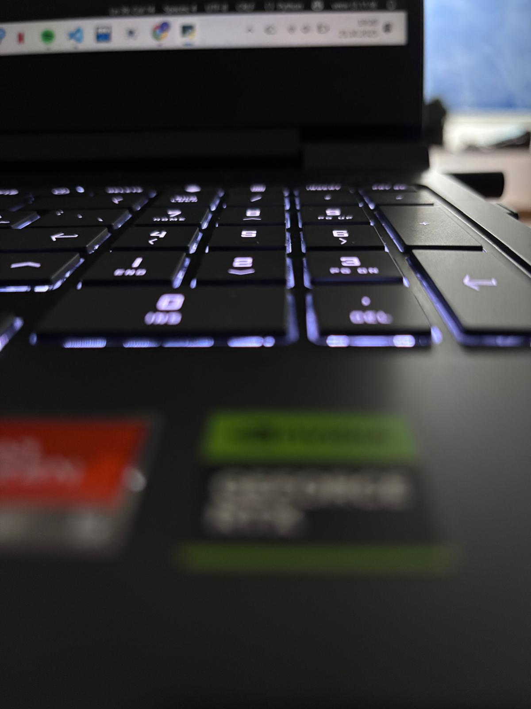
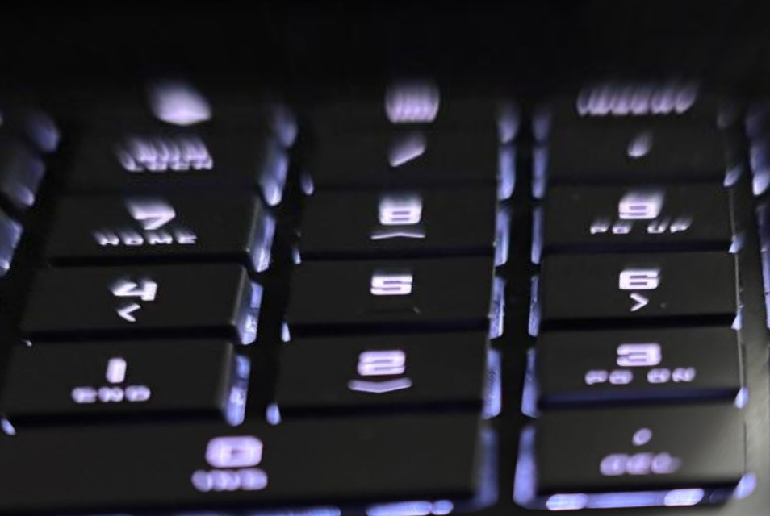

# 📐 Kuşbakışı Görüntü Düzeltici

Bu proje, eğik açıyla (perspektif bozulmasıyla) çekilmiş belge, yüzey veya nesne görüntülerini **fare ile manuel olarak 4 köşe belirleyerek düzleştiren** bir araçtır. Özellikle belgeleri, formları, kitap sayfalarını veya işaretli bölgeleri kuşbakışı görünümüne getirmek isteyenler için tasarlanmıştır.

---

## ✨ Özellikler

- ✅ Fare ile etkileşimli olarak 4 nokta seçme
- 🎯 Perspektif dönüşüm (homografi) ile görüntü düzleştirme
- ⬆️ Dikey eksende ölçeklendirme (görüntünün daha dik görünmesi için)
- 💾 Yüksek çözünürlüklü çıktı alma ve kaydetme
- 🖥️ Ekran çözünürlüğüne göre responsive görsel gösterimi

---

## 🖼️ Örnek Görseller

| Girdi Görseli | Kuşbakışı Dönüştürülmüş |
|---------------|--------------------------|
|  |  |

> Not: Girdiler ve çıktı dosyaları örnek olarak eklenmiştir. Kendi verinizi de kullanabilirsiniz.

---

## 📦 Gereksinimler

Projeyi çalıştırabilmek için aşağıdaki Python kütüphanelerine ihtiyacınız vardır:

- `opencv-python`
- `numpy`
- `screeninfo`

